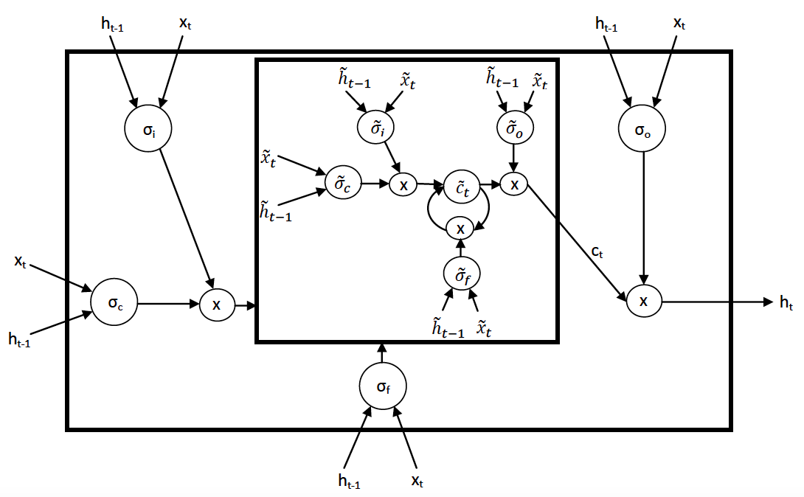

# nlstm
## Tensorflow Implementation of Nested LSTM Cell

Here is a tensorflow implementation of Nested LSTM cell.

|  |
|:--:| 
| *Nested LSTM Architecture. Courtesy of Moniz et al.* |

NLSTM cell is basically a LSTM-like cell that uses the cell memory to control the state of the inner LSTM, and as such, the architecture can be generalized to multiple layers. For a comparison between LSTM and NLSTM,

|  |
|:--:| 
| *LSTM and stacked LSTM, versus nested LSTM. Courtesy of Moniz et al.* |

The implementation  here is compatible with the tensorflow rnn API.

```python
from rnn_cell import NLSTMCell
cell = NLSTMCell(num_units=3, depth=2)
init_state = cell.zero_state(batch_size, dtype=tf.float32)
output, new_state = cell(inputs, state=init_state)
...
```

Ref:
- Moniz et al, "Nested LSTMs." https://arxiv.org/abs/1801.10308

